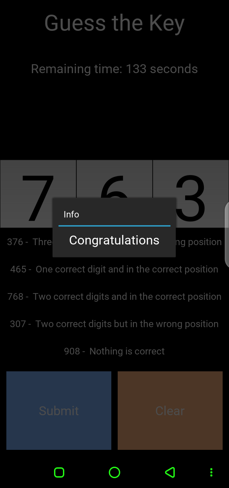
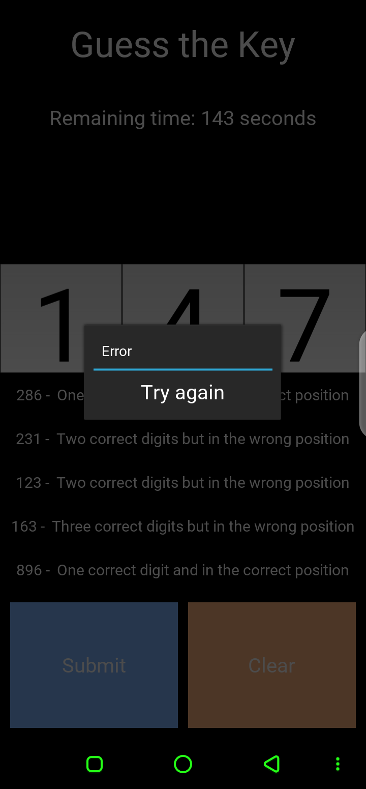

# Guess The Key

Guess The Key is a number guessing game where the player tries to guess a secret 3-digit key. The game provides hints to guide the player towards the correct key. This project includes a command-line version as well as a graphical user interface (GUI) built with Kivy.

## Installation

1. Clone the repository:

   ```
   git clone https://github.com/Git-Yousfi-Neji/GuessTheKey.git
   ```

2. Navigate to the project directory:

   ```
   cd guess-the-key
   ```

3. Install the required dependencies. You can use a virtual environment for isolation:

   ```
   python -m venv venv
   source venv/bin/activate  # For Linux/Mac
   venv\Scripts\activate  # For Windows
   pip install -r requirements.txt
   ```

## Usage

### Command-Line Version

1. Run the command-line version:

   ```
   python guess_key_cli.py
   ```

2. Follow the prompts to guess the key and receive hints. Enter your guesses as 3-digit numbers.

Correct Key:



Wrong Key:



### Graphical User Interface (GUI) Version

1. Run the GUI version:

   ```
   python guess_key_gui.py
   ```

2. The game window will open. Enter your guesses using the on-screen keypad and click the "Submit" button to check your guess. The hints will be displayed on the screen.

3. Use the "Clear" button to clear your guess and start over.

## How It Works

The game generates a secret 3-digit key at the beginning. You need to guess the key within a limited time. The game provides hints to guide you towards the correct key. The hints include:

- "Nothing is correct": None of the digits in your guess match the key.
- "One digit is correct and in the correct position": One digit in your guess matches the key and is in the correct position.
- "Two digits are correct and in the correct position": Two digits in your guess match the key and are in the correct positions.
- "One digit is correct but in the wrong position": One digit in your guess matches the key but is in the wrong position.
- "Two digits are correct but in the wrong positions": Two digits in your guess match the key but are in the wrong positions.
- "Three digits are correct but in the wrong positions": All three digits in your guess match the key but are in the wrong positions.

The game continues until you guess the correct key or run out of time.

## Contributing

Contributions to Guess The Key are welcome! If you find any issues or have suggestions for improvements, please open an issue or submit a pull request.

## License

This project is licensed under the [MIT License](LICENSE).

## Acknowledgements

- The graphical user interface (GUI) version of Guess The Key is built using the Kivy framework (https://kivy.org/).